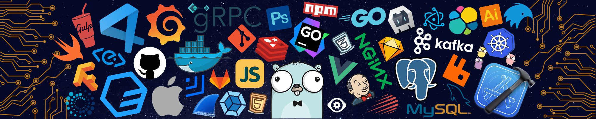

  

# 👋 About Me 
> Hello My name is Seno Rama Dhani, currently in Sumedang, Indonesia. 

     
    
    
    

    

---

# 💻 Skill and Tools 

  

# 📊 GitHub Stats 

    
    
    
    
    
    

###

 

###

